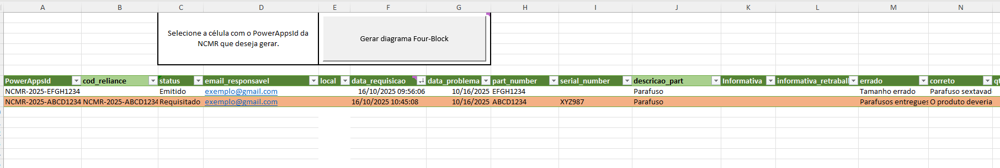
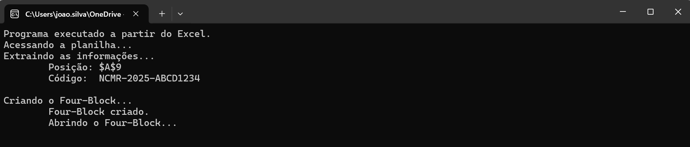
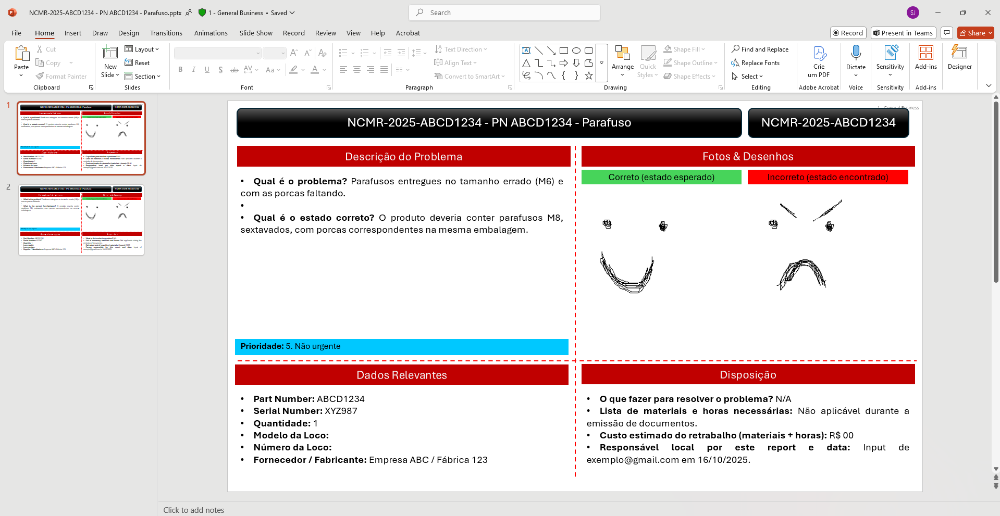

# PPTX-Automatico Teste

## Description / Descrição
ℹ️This solution creates a fully formatted Microsoft Power Point presentation from a row of data in a Microsoft Excel spreadsheet. A Python script using the xlwings and python-pptx libraries does the heavy lifting and the script can be executed from the terminal or can be called from a button in the spreadsheet.  
ℹ️Esta solução cria uma apresentação de Microsoft Power Point completamente formatada a partir de uma linha de dados em uma planilha Microsoft Excel. Um script Python usando as biblioteca xlwings e python-pptx faz o trabalho pesado e o script pode ser executado a partir do terminal ou de um botão na planilha.

📋The spreadsheet:   
📋A planilha:
<!--  -->
 

⚠️After the button is pressed, a confirmation message is shown:    
⚠️Depois de apertar o botão, uma mensagem de confirmação é exibida:
<!--  -->

🔃Some progress messages, shown during the script execution:    
🔃Algumas mensagens de progresso, exibidas durante a execução do script:

<!--  -->

✅The finished pptx file created:    
✅O arquivo pptx final criado:
<!--  -->

📂The added pictures are in a folder associated with the row code. The final pptx file is saved in this same folder.  
📂As figuras adicionadas estão em uma pasta associada ao código da linha. O arquivo pptx final é salvo nessa mesma pasta.

## Files / Arquivos

### The spreadsheet / A planilha ('banco_de_dados.xlsm')

### The Python script / O script Python ('pptx-automatico.py') 

### The pptx template / O template pptx ('template_ncmr.pptx')

▶️The file 'template_ncmr.pptx' is an empty .pptx presentation, but with templates in two slide masters with legends in Portuguese and English respectively. Each of these slide masters has twoslide layouts, one of them for the diagram with most of the information and an additional layout for extra pictures.  
▶️O arquivo 'template_ncmr.pptx' é uma apresentação .pptx vazia, mas com templates em dois *slide masters* com legendas em português e inglês respectivamente. Cada um desses *slide masters* possui dois *slide layouts*, um deles para o diagrama com a maioria das informações e um *layout* adicional para figuras extras.

🎞️These slide masters and slide layouts contain all the necessary placeholders for the [Python script](#the-python-script--o-script-python-pptx-automaticopy) to insert the data that is contained in the [spreadsheet](#the-spreadsheet--a-planilha-banco_de_dadosxlsm). For more information about *placeholders*, *slide masters* and *slide layouts*, access the link: [Documentation about placeholders](https://support.microsoft.com/en-us/office/add-edit-or-remove-a-placeholder-on-a-slide-layout-a8d93d28-66cb-43fd-9f9d-e12d0a7a1f06).  
🎞️Esses *slide masters* e *slide layouts* contém todos os *placeholders* necessários para que o [script Python](#the-python-script--o-script-python-pptx-automaticopy) faça a inserção dos dados contidos na [planilha](#the-spreadsheet--a-planilha-banco_de_dadosxlsm). Para mais informações sobre *placeholders*, *slide masters* e *slide layouts*, acesse o link a seguir: [Documentação sobre placeholders](https://support.microsoft.com/en-us/office/add-edit-or-remove-a-placeholder-on-a-slide-layout-a8d93d28-66cb-43fd-9f9d-e12d0a7a1f06)

## Instalation / Instalação 
