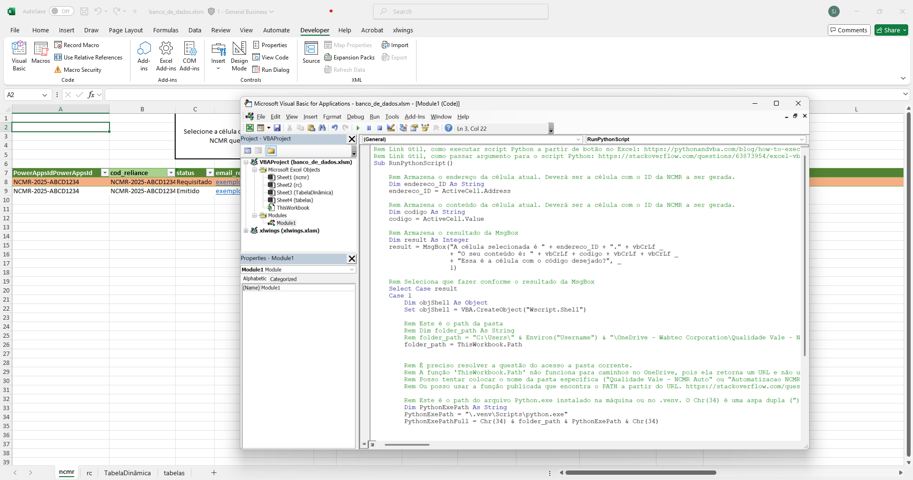
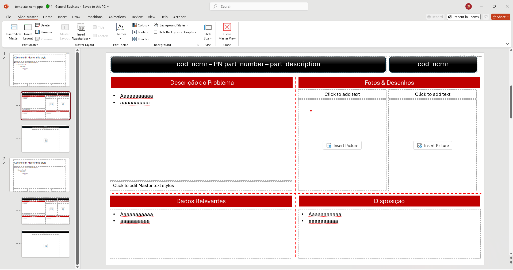

# PPTX-Automatico Teste

## Description / Descrição
ℹ️This solution creates a fully formatted Microsoft Power Point presentation from a row of data in a Microsoft Excel spreadsheet. A Python script using the xlwings and python-pptx libraries does the heavy lifting and the script can be executed from the terminal or can be called from a button in the spreadsheet.  
ℹ️Esta solução cria uma apresentação de Microsoft Power Point completamente formatada a partir de uma linha de dados em uma planilha Microsoft Excel. Um script Python usando as biblioteca xlwings e python-pptx faz o trabalho pesado e o script pode ser executado a partir do terminal ou de um botão na planilha.

📋The spreadsheet:   
📋A planilha:
<!--  -->
 

⚠️After the button is pressed, a confirmation message is shown:    
⚠️Depois de apertar o botão, uma mensagem de confirmação é exibida:
<!--  -->

📂The added pictures are in a folder associated with the row code. The final pptx file is saved in this same folder.  
📂As figuras adicionadas estão em uma pasta associada ao código da linha. O arquivo pptx final é salvo nessa mesma pasta.

## Files / Arquivos

### The spreadsheet / A planilha ('banco_de_dados.xlsm')

🔢The spreadsheet executes the Python script from a button. This button is configured in VBA code, which can be accessed in the spreadsheet by clicking in the Developer tab and then Visual Basic. More documentation and instructions about the configuration of the button can be seen in the comments in the VBA code and in the following links:  
🔢A planilha executa o script Python a partir de um botão. Esse botão é configurado em código VBA, que pode ser acessado na planilha clicando na aba *Developer* e em *Visual Basic*. Mais documentação e instruções sobre a configuração desse botão pode ser vista nos comentários no código VBA e nos links a seguir:

- [Python and VBA - How to execute a Python script from Excel using VBA](https://pythonandvba.com/blog/how-to-execute-a-python-script-from-excel-using-vba/)
- [Stack Overflow - Excel VBA pass arguments to Python script](https://stackoverflow.com/questions/63873954/excel-vba-pass-arguments-to-python-script)

### The Python script / O script Python ('pptx-automatico.py') 

### The pptx template / O template pptx ('template_ncmr.pptx')

▶️The file 'template_ncmr.pptx' is an empty .pptx presentation, but with templates in two slide masters with legends in Portuguese and English respectively. Each of these slide masters has twoslide layouts, one of them for the diagram with most of the information and an additional layout for extra pictures.  
▶️O arquivo 'template_ncmr.pptx' é uma apresentação .pptx vazia, mas com templates em dois *slide masters* com legendas em português e inglês respectivamente. Cada um desses *slide masters* possui dois *slide layouts*, um deles para o diagrama com a maioria das informações e um *layout* adicional para figuras extras.

🎞️These slide masters and slide layouts contain all the necessary placeholders for the [Python script](#the-python-script--o-script-python-pptx-automaticopy) to insert the data that is contained in the [spreadsheet](#the-spreadsheet--a-planilha-banco_de_dadosxlsm). To access the slide master click on View and Slide Master. More information about *placeholders*, *slide masters* and *slide layouts*, access the link: [Documentation about placeholders](https://support.microsoft.com/en-us/office/add-edit-or-remove-a-placeholder-on-a-slide-layout-a8d93d28-66cb-43fd-9f9d-e12d0a7a1f06).  
🎞️Esses *slide masters* e *slide layouts* contém todos os *placeholders* necessários para que o [script Python](#the-python-script--o-script-python-pptx-automaticopy) faça a inserção dos dados contidos na [planilha](#the-spreadsheet--a-planilha-banco_de_dadosxlsm). Para acessar os *slide masters* clique em *View* e *Slide Master*. Mais informações sobre *placeholders*, *slide masters* e *slide layouts*, acesse o link a seguir: [Documentação sobre placeholders](https://support.microsoft.com/en-us/office/add-edit-or-remove-a-placeholder-on-a-slide-layout-a8d93d28-66cb-43fd-9f9d-e12d0a7a1f06)

<!--  -->

## Instalation / Instalação 
