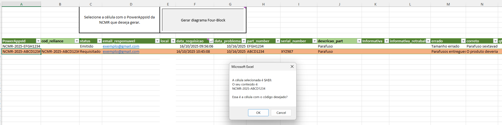

# PPTX-Automatico Teste

## Description / Descrição
ℹ️This solution creates a fully formatted Microsoft Power Point presentation from a row of data in a Microsoft Excel spreadsheet. A Python script using the xlwings and python-pptx libraries does the heavy lifting and the script can be executed from the terminal or can be called from a button in the spreadsheet.  
ℹ️Esta solução cria uma apresentação de Microsoft Power Point completamente formatada a partir de uma linha de dados em uma planilha Microsoft Excel. Um script Python usando as biblioteca xlwings e python-pptx faz o trabalho pesado e o script pode ser executado a partir do terminal ou de um botão na planilha.

📋The spreadsheet:   
📋A planilha:
<!--  -->
 

⚠️After the button is pressed, a confirmation message is shown:    
⚠️Depois de apertar o botão, uma mensagem de confirmação é exibida:
<!--  -->

🔃Some progress messages, shown during the script execution:    
🔃Algumas mensagens de progresso, exibidas durante a execução do script:

<!--  -->

✅The finished pptx file created:    
✅O arquivo pptx final criado:
<!--  -->

📂The added pictures are in a folder associated with the row code. The final pptx file is saved in this same folder.  
📂As figuras adicionadas estão em uma pasta associada ao código da linha. O arquivo pptx final é salvo nessa mesma pasta.

## Instalation / Instalação 
