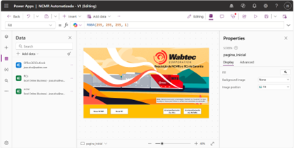
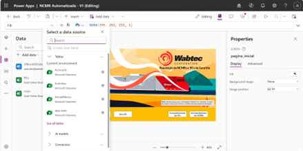
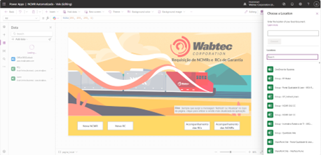
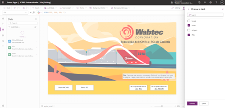
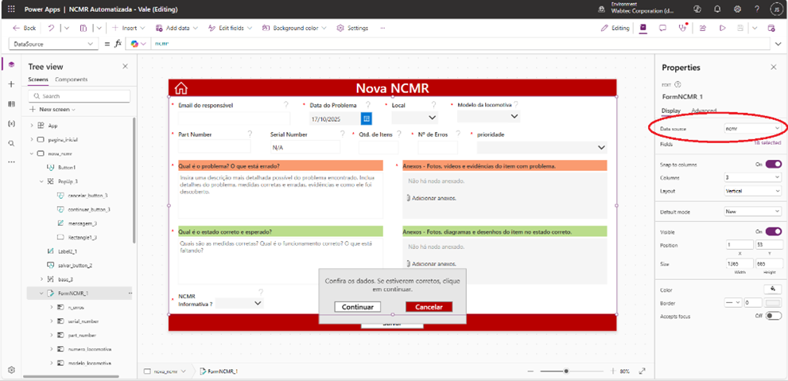
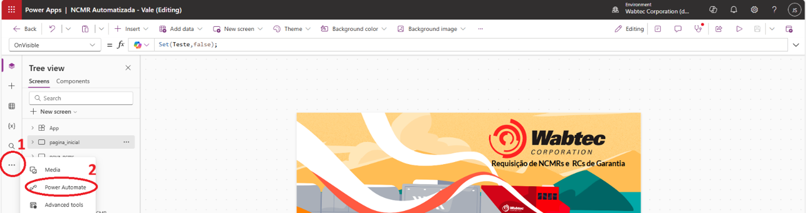
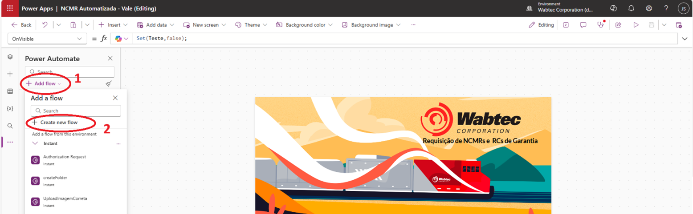

# Implementação do Formulário

## Cursos do PowerApps
- [Browse all training - Training | Microsoft Learn](https://learn.microsoft.com/en-us/training/browse/)
- [Create a canvas app in Power Apps - Training | Microsoft Learn](https://learn.microsoft.com/en-us/training/paths/create-powerapps/)
- [Create and manage canvas apps with Power Apps PL-7001 - Training | Microsoft Learn](https://learn.microsoft.com/en-us/training/paths/create-manage-canvas-apps-power-apps/)

## Partes:
- Pastas 
- Formulário / App
- Planilha
- Script Python
- Email

## O processo de implementação
### 1. Pastas
- É preciso ter uma pasta dedicada para a Planilha, para os arquivos (imagens, vídeos e powerpoints), e para o Script Python e a .venv adequada para executar o Script.
- Essa pasta precisa ser compartilhada com toda as pessoas que farão o uso das ferramentas. O SharePoint é o local que usamos para criá-la. 
- Para acessá-la em sua máquina (isso é necessário), clique em “Adicionar atalho aos Meus arquivos” ou “Add shortcut to My files”. Um atalho para essa pasta foi criado no seu OneDrive e provavelmente também no seu Explorador de Arquivos em seu computador.

### 2. Formulário / App
- Criar uma cópia
	- Acessar PowerApps
	- Clicar em “Apps” (na lateral esquerda)
- Selecionar o “Ambiente” ou “Environment” chamado Wabtec Corporation (na barra superior a direita)
- Clicar em em “Importar App” ou “Import App”, “Do arquivo (.msapp)” ou “From file (.msapp)”.
- Faça o upload do arquivo .msapp, na pasta que criou no Sharepoint.
- Vamos fazer algumas alterações no Formulário para se adequar a operação e ao cliente e para que ele funcione corretamente.
- Para começo de conversa, podemos alterar a página inicial do App para mostrar o logotipo ou o nome do cliente (Rumo, Vale, etc), mas não é necessário.

### 3. Conectar o App a planilha 
- Abra o App	
- Selecione o campo “Dados” ou “Data”, na barra à esquerda.  

 
- Clique em “Adicionar dados” ou “Add data”. A tela a seguir será exibida:  

 
- Clique em “Conexões” ou “Connectors” e em Excel Online (Business) e novamente em Excel Online (Business).
- Uma aba se abrirá a direita. Navegue e busque pela Planilha nessa aba.  

- Quando encontrar a planilha, clique nela, selecione as tabelas que deseja, e clique em Connect.  

- Para cada formulário e tabela de exibição, conecte com a base de dados adequada:  

 
### 4. Power Automate
- Clique em Power Automate no local indicado na figura a seguir:  
 

- Criar os fluxos.    

- É preciso de um fluxo para criar a pasta e outros para o upload das imagens.
- O link a seguir dá mais informações para o fluxo de upload das imagens: [Getting A Filename From SharePoint Document Folder and Creating the File In another Folder using PowerApps V2 trigger](https://community.powerplatform.com/forums/thread/details/?threadid=689a6407-9cc8-44d6-ae71-e7b92d82d6f3)
- Alterar os nomes dos fluxos na configuração “OnSelect” dos botões que os usam (“Continuar”).

### 5. Permissões
- Coletar os emails de quem vai usar.
- Dar permissões de acesso ao App e ao Sharepoint acima.

### 6. Email
- Alterar os emails de quem receberá o email automático no botão “Continuar”.

O processo de emissão de NCMRs

> 1.	O usuário (almoxarifado ou oficina) irá preencher o Formulário.
> 2.	O Formulário irá enviar um Email automático para quem precisa receber informando a requisição.
> 3.	Tudo que foi preenchido no Formulário será registrado na Planilha.
> 4.	Dados inseridos manualmente:
> >     a.	Buscar o PN no Oracle
> >     b.	Copiar o nome (Descrição) e fornecedor / fabricante e colar na planilha.
> >     c.	Criar uma nova NCMR no Reliance
> >     d.	Inserir o PN e o SN e selecionar Contagem no local
> >     e.	Salvar
> >     f.	Copiar o código da NCMR no Reliance e colar na planilha.
> 5.	Na Planilha é usado o Script Python (pelo botão no topo da página) e o Four-Block é criado.
> 6.	Traduzir a versão em inglês.
> 7.	Terminar de preencher os dados da NCMR no Reliance e emiti-la.
> 8.	Atualizar na Planilha que a NCMR foi emitida.
> 9.	Enviar um email, em resposta ao email automático, com o arquivo pptx do four-block em anexo:
> > “Bom dia a todos.
> >  
> >  Emitido: NCMR-2025-0000000  
> >  PN ABCD1234  
> >  Parafuso e porca tamanho 6mm
> > 
> > Devolver aos cuidados de _______, em ________ (Contagem, Betim, junto ao fornecedor, etc).
> > 
> >  Att.”
>
> .
